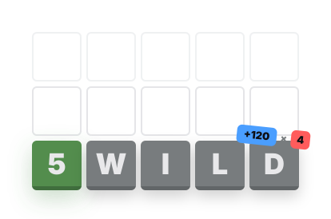
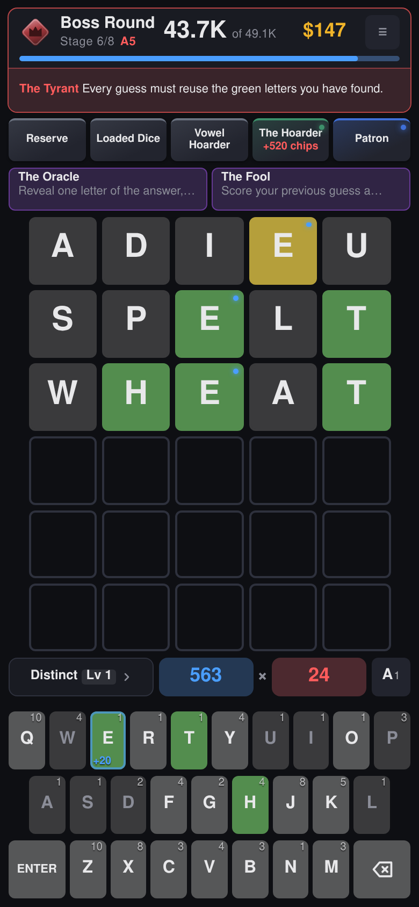

  <picture>
    <source media="(prefers-color-scheme: dark)" srcset="assets/wordmark-dark.svg">
    
  </picture>

<b>A word-guessing roguelike.</b>

  
  
  
  

---

  

Guess the five-letter word, but every guess you play is also a hand you score.
Letters are worth chips by how rare they are, green and yellow feedback adds
mult, and the relics you buy between rounds quietly rewrite the arithmetic
underneath. It is a word game that turns into a numbers game.

The tension is in the six guesses. A guess that narrows the word down is usually
made of cheap letters and scores almost nothing; a guess built to score plays the
letters you have upgraded, and spends a guess doing it.

Solving multiplies the round's whole pile by the guesses you had left, and every
guess you never spent pays gold at the shop. Farming one more big hand costs you
both, and the target is often high enough that you have to.

## What you are playing with

🏺 **Relics.** Forty-seven of them, bought between rounds, and they stack.
Snowball gains mult for every green you play; Q's Bargain triples J, Q, X and Z
until the worst letters in the alphabet are the ones you hunt for.

🔩 **Letter modifiers.** Nine upgrades, each bought onto a letter and kept on it
for the rest of the run. Steel doubles your mult, Glass triples it and might
shatter, and Wild pays you _more_ for being wrong.

👹 **Bosses.** Fifteen of them, one closing every stage, each breaking a rule you
were relying on. The Fog makes yellow and gray look identical, The Tyrant makes
every guess reuse the greens you have found, and The Mirror shows your feedback
back to front.

🃏 **Consumables.** Four one-shot cards, held until they matter. The Oracle hands
you a letter, The Hermit rules one out, The Magician turns a gray into a yellow,
and The Fool scores your last guess all over again.

✒️ **Etchings and categories.** An etching makes a whole group of letters worth
more chips for the rest of the run, and a pack levels up a word category, so the
shape you keep reaching for pays more every time you play it.

🪜 **Eight stages, then the ladder.** Win a run and the ascensions open, one rung
per win. The first ten each add a new rule to fight rather than a bigger number;
ninety more wait above them, and those only raise the targets.

🌍 **Four languages.** English, Spanish, French and German, each with its own
word list and its own keyboard, so a French run is AZERTY and a German one
QWERTZ.

## Play it

**Web:** <https://5-wild.com>

**Android:** [download the APK](https://github.com/jmelahman/5-wild/releases/latest/download/5-wild.apk)
straight from your phone's browser, with no store account and no cable. The first
time, Android asks permission to install from the browser. Everything ships
inside the package, word lists included, so it plays with no network at all, and
your runs and records stay on the device.

**Desktop:** the [Windows installer](https://github.com/jmelahman/5-wild/releases/latest/download/5-wild-windows-setup.exe), or on
Linux [the game itself](https://github.com/jmelahman/5-wild/releases/latest/download/5-wild-linux-x86_64), which needs marking executable
(`chmod +x`) and then runs. It uses the WebKitGTK already on most desktops; if
yours has none, the [deb](https://github.com/jmelahman/5-wild/releases/latest/download/5-wild-linux-amd64.deb) installs it for you on
Debian and Ubuntu, and the [AppImage](https://github.com/jmelahman/5-wild/releases/latest/download/5-wild-linux-x86_64.AppImage) brings
its own. It is the same game as the site in its own window, offline like the
APK. The installer is unsigned, so Windows warns about an unknown publisher the
first time.

**Source:** `npm ci && npm run dev` serves it at <http://localhost:5173>.
`CONTRIBUTING.md` has the rest.
