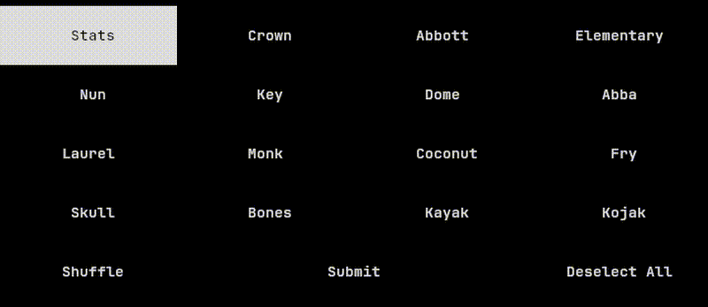

# NYT Connections TUI

[](https://github.com/jmelahman/connections/actions)
[](https://github.com/jmelahman/connections/actions)
[](https://pkg.go.dev/github.com/jmelahman/connections)
[](https://aur.archlinux.org/packages/connections)
[](https://pypi.org/project/nyt-connections/)
[](https://goreportcard.com/report/github.com/jmelahman/connections)

A command-line client for the NYT Connections game.



## Install

**AUR:**

`connections` is available from the [Arch User Repository](https://aur.archlinux.org/packages/connections).

```shell
yay -S connections
```

**pip:**

`connections` is available as a [pypi package](https://pypi.org/project/nyt-connections/).

```shell
pip install nyt-connections
```

**go:**

```shell
go install github.com/jmelahman/connections@latest
```

**github:**

Prebuilt packages are available from [Github Releases](https://github.com/jmelahman/connections/releases).
