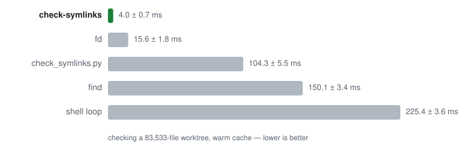

# Check Symlinks

[](https://github.com/jmelahman/check-symlinks/actions)
[](https://github.com/jmelahman/check-symlinks/actions)
[](https://aur.archlinux.org/packages/check-symlinks)
[](https://pypi.org/project/check-symlinks/)

Check for broken symbolic links.

```shell
$ check-symlinks
Broken symlink: some/path/broken_link
```

`check-symlinks` is optimized for large codebases as well as small, incremental checks,

<p align="center">
  <picture align="center">
    <source media="(prefers-color-scheme: dark)" srcset="docs/benchmark-dark.svg">
    <source media="(prefers-color-scheme: light)" srcset="docs/benchmark-light.svg">
    
  </picture>
</p>

where the full commands are respectively,

```shell
check-symlinks

fd --type symlink --exec sh -c 'test -e "$0"'

git ls-files | xargs pre_commit_hooks/check_symlinks.py

find . -type l ! -exec test -e {} \; -print0 | xargs --no-run-if-empty -0 git ls-files

while read file; do test -e "$file"; done < <(git ls-files)
```

and `check_symlinks.py` is from [https://github.com/pre-commit/pre-commit-hooks](https://github.com/pre-commit/pre-commit-hooks/blob/main/pre_commit_hooks/check_symlinks.py).
Regenerate the chart with `scripts/gen-benchmark-chart.py`, which documents the exact
hyperfine invocations.

## Install

**pre-commit:**

```yaml
repos:
  - repo: https://github.com/jmelahman/check-symlinks
    rev: v0.6.0
    hooks:
      - id: check-symlinks
```

The `check-symlinks` hook is built from source by pre-commit's Go toolchain and has no
other dependencies. Use `check-symlinks-system` instead to run a binary already on
`PATH`.

**AUR:**

`check-symlinks` is available from the [Arch User Repository](https://aur.archlinux.org/packages/check-symlinks).

```shell
yay -S check-symlinks
```

**pip:**

`check-symlinks` is available as a [pypi package](https://pypi.org/project/check-symlinks/).

```shell
pip install check-symlinks
```

**Binaries:**

Static binaries for Linux and macOS (amd64 and arm64) are attached to every
[release](https://github.com/jmelahman/check-symlinks/releases).

## Usage

```
check-symlinks [flags] [path ...]
```

With no paths, the current directory is walked. Flags must precede the paths.

| Flag | Description |
| --- | --- |
| `--hidden` | Include hidden files and directories in the walk. |
| `--no-ignore` | Ignore `.symlinkignore` / `.config/symlinkignore`. |
| `--threads N` | Number of worker threads (0 = one per CPU). |
| `-q`, `--quiet` | Don't print broken links. |
| `--debug` | Report which ignore file was loaded and which paths it skipped. |
| `--version` | Print the version and exit. |

Exit status is `0` when every symlink resolves, `1` when at least one is broken, and
`2` on a usage error.

Paths listed in `.symlinkignore` (or `.config/symlinkignore`) at the top of the
repository are skipped. Hidden entries are skipped while walking, but a hidden path
named on the command line is always checked.

## Building

`check-symlinks` is written in [Solod](https://solod.dev), a strict subset of Go that
translates to C: release binaries are a few hundred kilobytes, start instantly, and
have no runtime dependencies. The same sources build with either toolchain — see
[CONTRIBUTING.md](CONTRIBUTING.md).

```shell
so build -o check-symlinks ./so   # solod (needs the so tool and a C compiler)
go build .                        # Go, via the gocompat shims
```

Windows is not supported: Solod's `os` package is POSIX-only.
