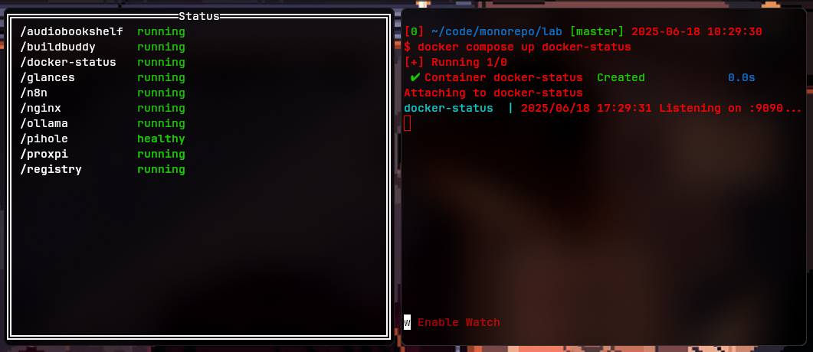

# Docker Status

Docker Status is a simple application that checks the health of Docker containers and provides a JSON endpoint to retrieve their status.



## Getting Started

Start the server via `docker` or `docker-compose`,

```
docker run \
  --rm \
  --name docker-status \
  -p 9090:9090 \
  -v ${XDG_RUNTIME_DIR:-/var/run}/docker.sock:/var/run/docker.sock:ro \
  lahmanja/docker-status:latest
```

```
services:
  docker-status:
    image: lahmanja/docker-status:latest
    container_name: docker-status
    restart: unless-stopped
    ports:
      - 9090:9090
    volumes:
      - ${XDG_RUNTIME_DIR:-/var/run}/docker.sock:/var/run/docker.sock:ro
```

Then hit the endpoint,

```shell
curl http://localhost:9090
```
