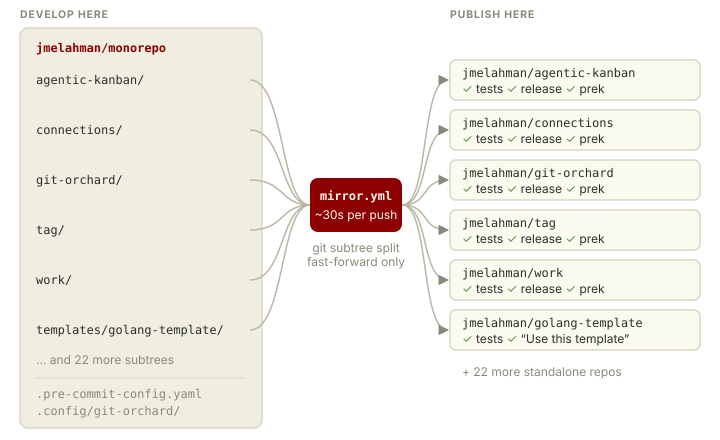
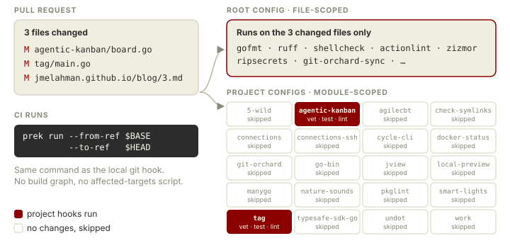
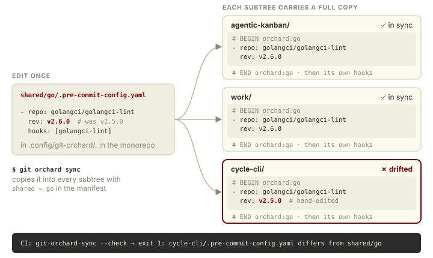
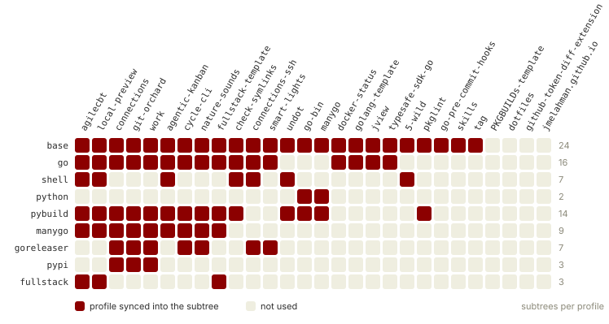
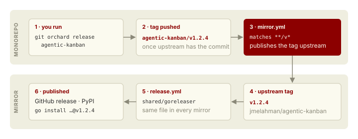
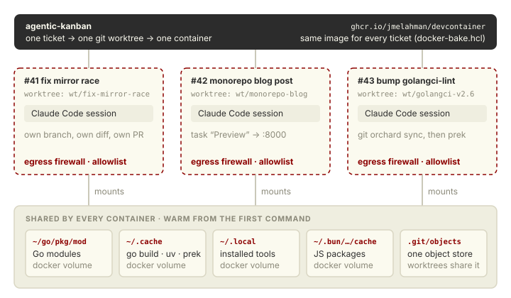

<!--
DRAFT. Not linked from blog/index.md yet.
Bracketed [TODO] notes are for me; delete before publishing.
Shape: every section is problem -> what you get -> how. Keep the "how" short and link out.
-->

# Your side projects want a monorepo

If you have more than a handful of side projects, you already know how this goes.

Each one started as a copy of the last one.
Each one has a `ruff.toml`, a lint workflow, a release workflow, a Dependabot config.
None of them match anymore.

A new version of golangci-lint comes out.
Updating it is one line, times N repositories, times N pull requests, times N CI runs you have to babysit.
So you update the three you're actively working on, and the rest quietly rot.
Six months later you open one of them to fix a bug and spend the first hour fixing the tooling instead.

The usual answer is "use a monorepo."
The usual reply is "that's for Google": you'd need Bazel, CI would take forever, and you'd lose the thing you actually like about small repos, which is that each project is its *own* thing, with its own README, issues, releases and `go install` path.

I have 28 projects in one repository, and none of those objections turned out to be true.
Every project still has its own GitHub repository that builds, tests and releases on its own.
I just never work in those repositories.
They're mirrors.

The whole setup is about 100 lines of GitHub Actions and one `.pre-commit-config.yaml`, and you can [copy it](#try-it).

{width=100%}

## You don't need a build system to get test selection

The first fear is CI.
Twenty-eight projects in Go, Python, TypeScript and shell sounds like either a 40-minute pipeline or a week of Bazel.

It's neither.
CI for everything is one [~40-line workflow](https://github.com/jmelahman/monorepo/blob/master/.github/workflows/pre-commit.yml) that runs [prek](https://prek.j178.dev/), and a pull request typically finishes in [TODO: typical PR time].
The full run over every file in every project, on `master`, is about 5 minutes.

The trick is that pre-commit already knows how to run only what changed, and prek (a Rust reimplementation of pre-commit) adds a *workspace mode*:

- The root `.pre-commit-config.yaml` sees the whole tree.
  It holds the file-scoped checks that don't care where a project starts and ends: formatters, linters, shellcheck, secret scanning, workflow linting.
- Each project's own `.pre-commit-config.yaml` runs from that project's directory.
  It holds the checks that need a project root: `go vet`, `go test`, `pytest`.

On a pull request, CI runs `prek --from-ref <base> --to-ref <head>`.
Hooks only see the files that changed, and a project's hooks only run if something in that project changed.
That's test selection, with no build graph and no "affected targets" script to maintain.

{width=100%}

<!-- [TODO] Show the one line from pre-commit.yml with the from-ref/to-ref ternary. -->

The part I didn't expect to care about: it's the *same* command locally.
The hook that runs on `git commit` is the hook that runs in CI, with the same pinned version, and hooks bring their own toolchains (`language: golang`, `language: python` with uv).
"Passes on my machine" and "passes CI" stop being two different claims.

## You don't have to give up your repositories

The second fear is lock-in: once everything lives in the monorepo, the individual projects stop being usable on their own.

Here, every push to `master` runs [`mirror.yml`](https://github.com/jmelahman/monorepo/blob/master/.github/workflows/mirror.yml), a ~30-line workflow with one step.
It uses [git-orchard](https://github.com/jmelahman/git-orchard) to split each project that changed out of the monorepo and push it to that project's own repository.
It takes about 30 seconds.

`git subtree split` is deterministic, so every push is a fast-forward.
Nothing is ever force-pushed, and a mirror's history is a real history you can `git log` and `git blame`.
<!-- [TODO] The no-concurrency-group detail from mirror.yml: an older run that finishes last is
     rejected as a non-fast-forward, not a rollback. -->

And the mirrors aren't read-only dumps.
Clone any of them and it builds, `prek install` gives you every hook that applies to it, and its own CI and release workflows run and pass.
That's because each mirror carries a *complete* copy of its tooling, not a reference back to the monorepo.
(Which sounds like a recipe for exactly the drift I started this post complaining about. That's the next section.)

The upshot: joining the monorepo is reversible.
If I ever change my mind, every project is already a standalone repository with its full history.

<!-- [TODO] One honest paragraph on contributions: someone opens a PR on a mirror; how does it get
     back in? (git subtree pull? cherry-pick?) -->

## Drift becomes a failing test

This is the part I'd build the whole thing for.

Shared tooling lives in *profiles* under `.config/git-orchard/shared/`: `base`, `go`, `python`, `shell`, `goreleaser`, `pypi`, and so on.
A profile is just a partial file tree, containing lint configs, pre-commit hooks and release workflows.
Each project lists the profiles it wants in one manifest:

```ini
[subtree "agentic-kanban"]
	remote = git@github.com:jmelahman/agentic-kanban.git
	branch = master
	shared = base
	shared = go
```

`git orchard sync` copies each profile into every project that asks for it.
Files are replaced whole, or, for things like `.pre-commit-config.yaml`, only between `# BEGIN orchard:go` and `# END orchard:go` markers, so a project keeps its own hooks alongside the shared ones.

So bumping golangci-lint is one edit and one command, and all 16 Go projects get it in the same commit, tested together in the same PR.

That's convenient, but convenience isn't the point.
The point is that `git-orchard-sync` is *also a pre-commit hook*.
If any project's copy differs from its profile, because someone (me, an agent) edited it by hand, CI fails, just like it would for an unformatted file.

{width=100%}

"We have a shared config" is a hope.
"It is impossible to merge a project whose config differs from the shared one" is a guarantee.
Most shared-config setups (a template repo, a `common/` directory, a reusable workflow) only give you the first.

{width=100%}

<!-- Generated from .config/git-orchard/subtrees; regenerate if the manifest changes. -->

It also fixes Dependabot.
The mirrors don't have a `dependabot.yml`; one config at the root covers every project, so an action bump is one grouped PR instead of 28, which then mirrors out.

## Releasing is one command, and it's the same command for everything

Every project used to have its own ritual: this one is `git tag` then `goreleaser`, that one is a GitHub release that triggers a PyPI upload, and one of them I never figured out again.

Now it's always:

```shell
git orchard release agentic-kanban
```

That picks the next version from the existing tags (`--minor`, `--major`, `--suffix rc`, `--dry-run`), including tags from before the project joined the monorepo.
It tags `agentic-kanban/v1.2.4` and pushes it.
The mirror workflow publishes it upstream as plain `v1.2.4`, and that fires the mirror's own release workflow.

{width=100%}

Those release workflows are profiles too (`goreleaser`, `pypi`), so a fix to the release process is also one edit and reaches every project.
And the things that must never happen are refused, not just discouraged: it won't tag a commit the upstream doesn't have yet, and it won't move a tag the upstream has already published, because the Go module proxy never forgets.

<!-- [TODO] Mention `tag` (my other tool), which `release` borrows its version-picking from. -->

## New projects start as current as your newest one

A project template is perfect on the day you write it.
A year later, everything made from it starts life with a year-old lint config.

My templates (`golang-template`, `fullstack-template`, `PKGBUILDs-template`) are subtrees like any other project, with the same profiles.
Every tooling bump that reaches my projects reaches the templates in the same commit, `sync --check` fails if one drifts, and each template's own tests catch it if a change breaks it.
**A template is exactly as current as my newest project, by construction.**
They're mirrored out as ordinary GitHub template repositories, so "Use this template" works for anyone.

Starting a project is then:

1. Copy a template in (or "Use this template" on GitHub and `git orchard add` it).
2. Add a `[subtree]` block with its profiles.
3. `git orchard sync`, commit, push.

It has lint, tests, CI, and a release pipeline before it has any code.
<!-- [TODO] Check these steps against what I actually do. The upstream repo has to exist first, with
     the GitHub App installed on it. -->

## It's the right shape for working with agents

This is the reason I'd give if you only have time for one.

Most of my changes now start as a ticket on [agentic-kanban](https://github.com/jmelahman/agentic-kanban), which gives each ticket a Claude Code session in its own git worktree and its own container.
Several can run at once.
A monorepo makes that work much better than N repositories would:

- **The guardrails are the same everywhere.**
  An agent's change can't land unless the same pinned hooks pass, in any project, including the check that it didn't hand-edit shared config.
  I don't have to remember which repositories have which checks.
- **The context is all there.**
  One `git grep` shows the agent how the same problem was already solved in another project, in another language.
  One `CLAUDE.md` and one set of conventions cover everything.
- **Cross-cutting changes are one ticket.**
  "Bump golangci-lint" is one worktree and one PR, not 16.

The environment matters as much as the repository.
Every container is the same image, built from [`docker-bake.hcl`](https://github.com/jmelahman/monorepo/blob/master/docker-bake.hcl) and published to `ghcr.io/jmelahman/devcontainer`, with an egress firewall that only allows a short list of domains.
In practice that means:

- **Safe.** Worst case, an agent trashes its own worktree.
- **Reproducible.** The tools in the container are the tools the hooks pin, for every ticket in every project.
- **Independent.** One worktree per ticket: no stashing, no branch juggling, no two agents editing the same checkout.

{width=100%}

The catch with a fresh container per ticket is cold caches, and that's where worktrees and named Docker volumes come in.
Every container mounts the same volumes:

```json
"source=devcontainer-go-mod,target=/home/dev/go/pkg/mod,type=volume",
"source=devcontainer-cache,target=/home/dev/.cache,type=volume",
"source=devcontainer-local,target=/home/dev/.local,type=volume",
"source=devcontainer-bun,target=/home/dev/.bun/install/cache,type=volume"
```

`~/.cache` holds the Go build cache, uv, and prek's hook environments, and worktrees share one git object store.
So a brand new ticket runs the full hook suite warm from its first command.
[TODO: cold vs. warm number for the first `prek run` in a fresh ticket.]

Reviewing the *output*, not just the diff, works the same way.
Projects declare their dev servers in `.vscode/tasks.json`, and `.kanban.toml` maps a task to a container port, so the ticket gets a **Run** button that forwards it to the host.
This post is an example: the blog has a `Preview` task that builds it with pandoc and serves it, and I read every draft in the browser from its ticket.
(Pandoc comes from the `pypandoc_binary` wheel through uv, so thanks to the shared cache it downloads once.)

## The things you get without asking

Once one config reaches every project, anything you put in it is enforced everywhere, mirrors included:

- **Supply-chain hygiene.** Every action and hook pinned to a SHA (`# frozen: vX`), `permissions: {}` by default, `persist-credentials: false`, and [zizmor](https://github.com/zizmorcore/zizmor) and actionlint on every workflow.
- **Secret scanning** (ripsecrets and `detect-private-key`) on every commit.
- **Cross-language workspaces.** `go.work` and a uv workspace let me change a shared library and its consumers in one commit, tested together.
  [TODO: confirm how the mirrors resolve those dependencies.]
- **One history.** `git log`, `git grep` and blame across everything.

<!-- [TODO] Trim to the two or three strongest. -->

## What it costs

<!-- Readers trust the pitch more if this section is honest. -->
- **Full clones.** `fetch-depth: 0` everywhere, because prek's diffing and subtree splits need history.
  Fine at ~1,400 commits; it won't be free forever.
- **Contributions to mirrors need a manual path back** into the monorepo.
- **Shared CI means shared system dependencies.** One project needs ALSA headers, so every CI run installs them.
- **Hook ordering matters.** A generator hook has to run before `git-orchard-sync`, or the sync copies stale output.
- **It's built for one committer.** For a team you'd want CODEOWNERS and a real review process on shared profiles, since one edit reaches every project.

None of these has cost me anywhere near what a single round of "update the tooling in every repo" used to.

## What I'd add at a bigger scale

For one person, the setup above is enough.
With more projects, more people, or more at stake, these are the next things I'd reach for:

- **Repository settings as code.**
  The manifest already lists every mirror, so it can manage their settings too: description, topics, whether issues are on, branch rules, the GitHub App installation.
  That also covers the one manual step left in starting a project, which is creating the upstream repository.
  This one I'm building for myself.
- **Nightly full runs.**
  Pull requests only check what changed, so breakage that doesn't come from a commit, like a new Go release, a new vulnerability advisory, or an upstream action changing, shows up in whichever unrelated PR happens to run next.
  A scheduled `prek run --all-files` finds it first.
- **Cheaper clones.**
  prek's diffing and the subtree splits need full history, not every old file's contents.
  A blobless clone (`git clone --filter=blob:none`) gets the history and downloads file contents only when they're needed.
- **Locked-down mirrors.**
  Mirroring only ever fast-forwards, so one stray push to a mirror blocks every mirror push after it.
  Rules that let only the GitHub App push, and that protect release tags, make the one-way flow enforced rather than a habit.
- **A check that the mirrors are current.**
  Each mirror's CI badge says whether its tests pass, not whether it got the latest push.
  A scheduled job that compares each subtree's split with its mirror's `HEAD` would catch a mirror that silently fell behind.

<!-- [TODO] Trim to the ones I actually want to mention. -->

## Try it

You don't need 28 projects for this to pay off.
It starts paying the second time you'd have copied a config file between repositories.

[monorepo-template](https://github.com/jmelahman/monorepo-template) is this setup with my projects removed: the root `.pre-commit-config.yaml`, the CI and mirror workflows, an empty git-orchard manifest, and a starter `base` profile.
<!-- [TODO] Confirm the link once the mirror repo exists. -->
It's a subtree of my monorepo with the same `base` profile, so it stays as current as the real thing, by the same trick as everything else in this post.

1. "Use this template," then `git orchard github-app` to set up mirroring.
2. `git orchard add` your first project and give it `shared = base`.
3. `git orchard sync`, commit, push.

Then bump something once and watch it land everywhere.

One repository to develop in, many to publish, and a pre-commit hook that makes sure they never disagree.

<!-- [TODO] Links: monorepo, git-orchard, agentic-kanban, prek. -->
