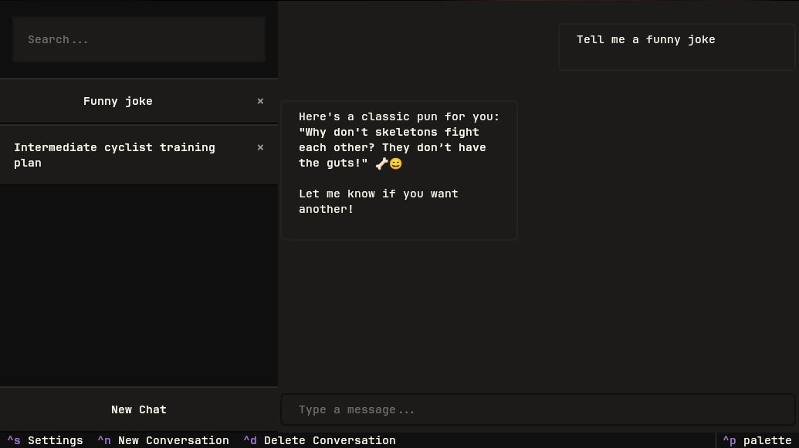

# Ollama Chat TUI

A simple and straightforward way to interface with an Ollama server.



## Installing

For now, the intended way to run the application is via a [PEP 0723 script](https://peps.python.org/pep-0723/),

```
curl -o ollama_chat.py -sS https://github.com/jmelahman/monorepo/tree/master/ollama_chat/main.py
uv run ollama_chat.py
```
