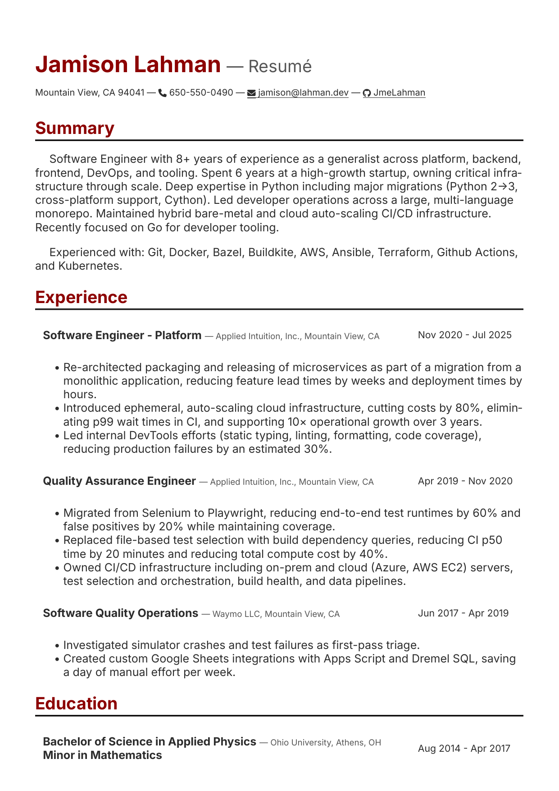

# Resume

Source for compiling the resume published to [https://jamison.lahman.dev/resume/](https://jmelahman.github.io/resume/).

The resume is compiled to an HTML file with a [Markdown](https://www.markdownguide.org/) file as input using [pandoc](https://pandoc.org/).
The conversion from HTML to PDF is done by [weasyprint](https://weasyprint.org/).
This version comes in light and dark variations.

### Preview

<p align="left">
  
</p>

## Building

The default resume can be built with,

```shell
./build
```
Or alternatively, with dark theme and PDF format output respectively,

```shell
./build --dark
```

```shell
./build --pdf
```
