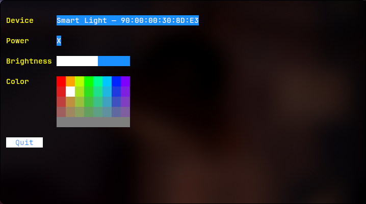

# Smart Light TUI

A simple terminal interface for controlling the DayBetter LED strip lights.

Handles Power On/Off, Brightness, and Color.



## Installation

```shell
go install github.com/jmelahman/smart-lights
```
